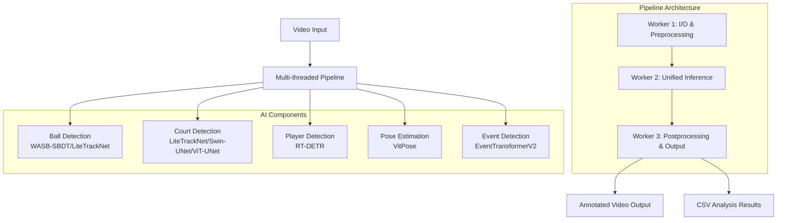

# Tennis Systems - AI-Powered Tennis Video Analysis Platform

## 1. Executive Summary

### 1.1 Project Overview
Tennis Systems is a comprehensive AI-powered platform for automated tennis video analysis, providing real-time multi-modal analysis of tennis matches. The system integrates five core AI components to extract comprehensive insights from tennis videos:

- **Ball Detection & Tracking**: High-precision ball detection and trajectory tracking
- **Court Detection**: Tennis court keypoint detection (15 keypoints)
- **Player Detection**: RT-DETR based player detection
- **Pose Estimation**: 17 keypoint pose estimation using VitPose
- **Event Detection**: Multi-modal time-series analysis for hit/bounce detection

### 1.2 Key Features
- **Modular Pipeline Architecture**: Independent components that can be used standalone or integrated
- **Hydra Configuration Management**: Unified configuration system replacing argparse
- **Multi-threaded Processing**: Optimized pipeline with I/O, inference, and post-processing workers
- **Real-time Capabilities**: Support for both batch and real-time video processing
- **Standalone WASB Integration**: Local implementation eliminating third-party dependencies

### 1.3 Technical Achievements
- **Model Diversity**: Choice between lightweight (LiteTrackNet) and high-accuracy (Video Swin Transformer) models
- **Fine-tuned Detection**: RT-DETR specialized for tennis player detection
- **Multi-modal Fusion**: EventTransformerV2 integrating ball, court, player, and pose information
- **Production-Ready**: PyTorch Lightning training pipelines with Hydra configuration management

---

## 2. System Architecture

### 2.1 Overall Pipeline Architecture



### 2.2 Component Architecture

#### 2.2.1 Core Components Structure
```
src/
├── ball/              # Ball detection and tracking
│   ├── models/        # Model architectures (LiteTrackNet, Video Swin)
│   ├── pipeline/      # Standalone WASB pipeline
│   └── local_classifier/  # Ball classification modules
├── court/             # Court keypoint detection
│   ├── models/        # LiteTrackNet, Swin-UNet, ViT-UNet
│   └── pipeline/      # Court detection pipeline
├── player/            # Player detection
│   ├── models/        # RT-DETR implementation
│   └── pipeline/      # Player detection pipeline
├── pose/              # Pose estimation
│   └── pipeline/      # VitPose integration
├── event/             # Event detection
│   └── model/         # EventTransformerV2
└── integrate/         # Unified analysis pipeline
    └── pipeline_demo.py  # Main integration script
```

#### 2.2.2 Configuration Architecture
```
configs/
├── train/             # Training configurations
│   ├── ball/         # Ball detection training configs
│   ├── court/        # Court detection training configs
│   ├── player/       # Player detection training config
│   └── event/        # Event detection training configs
└── infer/            # Inference configurations (NEW)
    ├── ball/         # Ball tracking pipeline config
    ├── court/        # Court detection pipeline config
    ├── player/       # Player detection pipeline config
    ├── pose/         # Pose estimation pipeline config
    └── integrate/    # Unified pipeline config
```

---

## 3. Model Specifications

### 3.1 Ball Detection Models

#### 3.1.1 WASB-SBDT (Primary)
- **Architecture**: HRNet-based detection with online tracking
- **Input**: 3-frame sequences (RGB)
- **Output**: Ball coordinates with confidence scores
- **Tracking**: OnlineTracker with motion prediction
- **Implementation**: Standalone local modules (`src/ball/pipeline/wasb_modules/`)

#### 3.1.2 LiteTrackNet (Alternative)
- **Architecture**: Lightweight U-Net with efficiency optimizations
- **Features**: DSConv, SE Blocks, PixelShuffle upsampling
- **Input**: 3-frame sequences
- **Output**: Heatmap-based ball position

#### 3.1.3 Video Swin Transformer (High-accuracy)
- **Architecture**: Transformer-based temporal modeling
- **Input**: Multi-frame video sequences
- **Output**: Temporally-aware ball detection

### 3.2 Court Detection Models

#### 3.2.1 LiteTrackNet (Standard)
- **Architecture**: U-Net encoder-decoder
- **Input**: Single RGB frame
- **Output**: 15-channel heatmap (15 keypoints)
- **Keypoints**: Baseline, service lines, net, court boundaries

#### 3.2.2 Swin-UNet (Enhanced)
- **Architecture**: Swin Transformer encoder + U-Net decoder
- **Features**: Hierarchical attention, better global context

#### 3.2.3 ViT-UNet (Experimental)
- **Architecture**: Vision Transformer encoder + U-Net decoder
- **Features**: Self-attention for global feature modeling

### 3.3 Player Detection Model

#### 3.3.1 RT-DETR v2
- **Base Model**: `PekingU/rtdetr_v2_r18vd`
- **Architecture**: Real-time Detection Transformer
- **Training Strategy**: 
  - Stage 1: Frozen backbone, head-only training
  - Stage 2: Full model fine-tuning with differential learning rates
- **Classes**: Player, Ball, Referee
- **Post-processing**: NMS, confidence filtering

### 3.4 Pose Estimation Model

#### 3.4.1 VitPose
- **Model**: `usyd-community/vitpose-base-simple`
- **Architecture**: Vision Transformer for pose estimation
- **Input**: Player bounding boxes (from RT-DETR)
- **Output**: 17 COCO keypoints per player
- **Features**: Strong occlusion handling, global context understanding

### 3.5 Event Detection Model

#### 3.5.1 EventTransformerV2
- **Architecture**: Multi-modal time-series Transformer
- **Inputs**: Ball, court, player, pose features
- **Process**:
  1. Modality-specific embeddings
  2. Player attention pooling
  3. Modality-specific Transformers
  4. Cross-attention fusion
  5. Classification head
- **Outputs**: Hit/bounce probabilities
- **Loss Function**: Weighted BCE + Clarity Regularizer

---

## 4. Pipeline Implementation

### 4.1 Hydra Configuration System

#### 4.1.1 Configuration Structure
All pipelines now use Hydra for unified configuration management:

```yaml
# Example: configs/infer/integrate/pipeline_demo.yaml
hydra:
  output_subdir: hydra_outputs/${now:%Y-%m-%d_%H-%M-%S}
  run:
    dir: outputs/infer/integrate/pipeline_demo/${now:%Y-%m-%d_%H-%M-%S}

# Task enabling/disabling
tasks:
  court: true
  pose: true  
  ball: true

# Component configurations
court:
  checkpoint: "checkpoints/court/lit_vit_unet/best_model.ckpt"
  input_size: [224, 224]
  score_threshold: 0.3

player:
  checkpoint: "checkpoints/player/lit_rt_detr/best_model.ckpt"
  threshold: 0.7

ball:
  model_path: "checkpoints/ball/hrnet/wasb_tennis_best.pth.tar"
  score_threshold: 0.5

# Visualization settings
visualization:
  enabled: true
  court:
    draw_keypoints: true
    draw_skeleton: true
  pose:
    draw_boxes: true
    draw_keypoints: true
  ball:
    draw_trajectory: true
```

#### 4.1.2 Pipeline Execution
```bash
# Individual components
python src/ball/pipeline/standalone_wasb_demo.py io.video=input.mp4
python src/court/pipeline/pipeline_demo.py io.video=input.mp4 court.checkpoint_path=model.ckpt
python src/player/pipeline/pipeline_demo.py io.video=input.mp4
python src/pose/pipeline/pipeline_demo.py io.video=input.mp4

# Integrated analysis
python src/integrate/pipeline_demo.py io.video=input.mp4
```

### 4.2 Multi-threaded Pipeline Architecture

#### 4.2.1 Thread Organization
1. **Worker 1 (I/O & Preprocessing)**:
   - Video frame reading
   - Batch preparation
   - Preprocessing for all models

2. **Worker 2 (Unified Inference)**:
   - GPU-accelerated model inference
   - Batch processing optimization
   - Memory management

3. **Worker 3 (Postprocessing & Output)**:
   - Result visualization
   - Video writing
   - CSV export

#### 4.2.2 Queue Management
- **Configurable queue sizes**: `batch_size * queue_size_multiplier`
- **Backpressure handling**: Prevents memory overflow
- **Thread synchronization**: Clean shutdown mechanisms

### 4.3 Standalone WASB Integration

#### 4.3.1 Local Implementation
The system now includes a complete standalone implementation of WASB-SBDT:

```
src/ball/pipeline/wasb_modules/
├── __init__.py           # Core exports and tracker
├── config.py            # Configuration management
├── pipeline_modules.py  # Preprocessing, detection, postprocessing
└── drawing_utils.py     # Visualization utilities
```

#### 4.3.2 Key Components
- **BallPreprocessor**: Frame sequence preparation
- **BallDetector**: HRNet-based ball detection
- **DetectionPostprocessor**: Coordinate extraction and filtering
- **OnlineTracker**: Motion-based ball tracking
- **Configuration**: Default WASB settings with customization

---

## 5. Data Processing & Formats

### 5.1 Input/Output Specifications

#### 5.1.1 Input Requirements
- **Video Format**: MP4, AVI, MOV (OpenCV-compatible)
- **Resolution**: Any (automatically resized per model requirements)
- **Frame Rate**: Any (preserved in output)

#### 5.1.2 Output Formats

##### 5.1.2.1 Video Output
- **Format**: MP4 with annotations
- **Annotations**:
  - Ball trajectory with confidence visualization
  - Court keypoints and skeleton
  - Player bounding boxes
  - Pose keypoints and skeleton
  - Event markers (hit/bounce indicators)

##### 5.1.2.2 CSV Output
Comprehensive frame-by-frame analysis results:

```csv
frame_idx,ball_visible,ball_x,ball_y,ball_score,
court_kp_0_x,court_kp_0_y,court_kp_0_score,...,
p0_score,p0_x1,p0_y1,p0_x2,p0_y2,
p0_kp0_x,p0_kp0_y,p0_kp0_s,...
```

### 5.2 Data Processing Pipeline

#### 5.2.1 Preprocessing
- **Standardization**: Consistent input formats across models
- **Augmentation**: Training-time data augmentation (Albumentations)
- **Batching**: Efficient GPU utilization

#### 5.2.2 Postprocessing
- **Coordinate Mapping**: Model output to original frame coordinates
- **Filtering**: Confidence-based result filtering
- **Smoothing**: Temporal consistency for tracking
- **Visualization**: Annotation rendering

---

## 6. Training Infrastructure

### 6.1 PyTorch Lightning Framework

#### 6.1.1 Training Components
- **LightningModule**: Model training logic
- **LightningDataModule**: Data loading and preprocessing
- **Trainer**: Training orchestration and optimization
- **Callbacks**: Checkpointing, early stopping, logging

#### 6.1.2 Training Execution
```bash
# Component-specific training
bash scripts/train/ball/lite_tracknet_focal.sh
bash scripts/train/court/lite_tracknet_focal.sh  
bash scripts/train/player/rt_detr.sh
bash scripts/train/event/event_transformer.sh

# Direct API calls
python -m src.ball.api.train --config-name lite_tracknet_focal
python -m src.court.api.train --config-name config
python -m src.player.api.train --config-name config
python -m src.event.api.train --config-name config
```

### 6.2 Configuration Management

#### 6.2.1 Modular Configuration
- **Trainer configs**: Learning rates, epochs, optimization
- **Model configs**: Architecture parameters
- **Data configs**: Dataset paths, augmentation
- **Callback configs**: Checkpointing, monitoring

#### 6.2.2 Hydra Integration
- **Composition**: Mix and match configuration components
- **Override**: Command-line parameter overrides
- **Experiment tracking**: Automatic output organization

---

## 7. Testing & Quality Assurance

### 7.1 Test Suite Organization

#### 7.1.1 Test Categories
```bash
# Model instantiation tests
python -m pytest tests/infer_model_instantiate/

# Dataset tests  
python -m pytest tests/data/

# Compatibility tests
python -m pytest tests/valid_output_format/

# Integration tests
python -m pytest tests/ball_pipeline_integration_test.py
```

#### 7.1.2 Test Coverage
- **Model Loading**: Checkpoint compatibility
- **Data Pipeline**: Dataset loading and preprocessing
- **Output Format**: Model output consistency
- **Integration**: End-to-end pipeline functionality

### 7.2 Performance Monitoring

#### 7.2.1 Timing Analysis
- **Stage-wise profiling**: I/O, inference, postprocessing times
- **Memory tracking**: GPU/CPU memory usage
- **Throughput metrics**: Frames per second processing

#### 7.2.2 Quality Metrics
- **Detection accuracy**: Precision, recall, F1 scores
- **Tracking consistency**: Temporal smoothness
- **System reliability**: Error handling and recovery

---

## 8. Development Tools & Utilities

### 8.1 Annotation System

#### 8.1.1 Web-based Annotation Interface
```bash
cd tools/annotation
./run_annotation_system.sh setup
./run_annotation_system.sh start
# Access at http://localhost:8000
```

#### 8.1.2 Annotation Workflow
- **Video upload**: Support for multiple formats
- **Frame-by-frame annotation**: Precise labeling
- **Export formats**: COCO JSON, custom formats
- **Quality control**: Review and validation tools

### 8.2 Development Scripts

#### 8.2.1 Data Preparation
```bash
# Generate empty annotations
python tools/annotation/generate_empty_annotations.py

# Merge to COCO format
python tools/annotation/merge_to_coco.py

# Extract frames
python tools/video_clipper/interactive_frame_extractor.py
```

#### 8.2.2 Model Utilities
```bash
# Checkpoint validation
python tools/check/chekpoint_checker.py

# Code collection
python tools/collect/all_code_collector.py
```

---

## 9. Deployment & Production

### 9.1 Environment Setup

#### 9.1.1 Dependencies
```bash
# Core ML frameworks
pip install torch torchvision torchaudio --index-url https://download.pytorch.org/whl/cu118
pip install pytorch-lightning

# Configuration and utilities
pip install hydra-core omegaconf
pip install transformers opencv-python
pip install gradio pandas matplotlib

# Optional: Development tools
pip install pytest black flake8
```

#### 9.1.2 Model Checkpoints
```
checkpoints/
├── ball/
│   ├── wasb_tennis_best.pth.tar      # WASB-SBDT model
│   └── lite_tracknet/                # LiteTrackNet models
├── court/
│   ├── lit_vit_unet/                 # ViT-UNet models
│   └── lit_swin_unet/                # Swin-UNet models
├── player/
│   └── lit_rt_detr/                  # RT-DETR models
└── event/
    └── transformer_v2/               # Event detection models
```

### 9.2 Production Considerations

#### 9.2.1 Performance Optimization
- **GPU Memory Management**: Efficient batch processing
- **Multi-threading**: Optimal resource utilization
- **Model Selection**: Choose appropriate models for speed/accuracy trade-offs

#### 9.2.2 Monitoring & Logging
- **Structured logging**: Comprehensive event tracking
- **Performance metrics**: Real-time monitoring
- **Error handling**: Graceful degradation and recovery

---

## 10. API Reference

### 10.1 Core Pipeline APIs

#### 10.1.1 Individual Component APIs
```python
# Ball tracking
from src.ball.pipeline.standalone_wasb_demo import StandaloneTennisTracker
tracker = StandaloneTennisTracker(cfg)
tracker.run()

# Court detection  
from src.court.pipeline.pipeline_demo import MultithreadedCourtDetector
detector = MultithreadedCourtDetector(cfg)
detector.run()

# Player detection
from src.player.pipeline.pipeline_demo import MultithreadedPlayerDetector
detector = MultithreadedPlayerDetector(cfg)
detector.run()

# Pose estimation
from src.pose.pipeline.pipeline_demo import MultithreadedPosePipeline
pipeline = MultithreadedPosePipeline(cfg)
pipeline.run()

# Integrated analysis
from src.integrate.pipeline_demo import IntegratedTennisAnalysisPipeline
pipeline = IntegratedTennisAnalysisPipeline(cfg)
pipeline.run()
```

#### 10.1.2 Configuration Loading
```python
import hydra
from omegaconf import DictConfig

@hydra.main(config_path="configs/infer/integrate", config_name="pipeline_demo", version_base=None)
def main(cfg: DictConfig) -> None:
    # Your pipeline code here
    pass
```

### 10.2 Model Loading APIs

#### 10.2.1 PyTorch Lightning Models
```python
# Standard Lightning checkpoint loading
from src.ball.lit_module.lit_lite_tracknet_focal import LitLiteTracknetFocalLoss
model = LitLiteTracknetFocalLoss.load_from_checkpoint("path/to/checkpoint.ckpt")
model.eval()

# Court detection
from src.court.lit_module.lit_vit_unet import LitViTUNet
model = LitViTUNet.load_from_checkpoint("path/to/checkpoint.ckpt")

# Player detection
from src.player.lit_module.lit_rtdetr import LitRtdetr
model = LitRtdetr.load_from_checkpoint("path/to/checkpoint.ckpt")
```

#### 10.2.2 HuggingFace Models
```python
# Pose estimation
from transformers import VitPoseForPoseEstimation
model = VitPoseForPoseEstimation.from_pretrained("usyd-community/vitpose-base-simple")
```

---

## 11. Troubleshooting Guide

### 11.1 Common Issues

#### 11.1.1 Environment Issues
- **CUDA compatibility**: Ensure PyTorch CUDA version matches system CUDA
- **Memory errors**: Reduce batch sizes in configuration
- **FFmpeg errors**: Install FFmpeg for video processing
- **Import errors**: Verify PYTHONPATH includes project root

#### 11.1.2 Model Issues
- **Checkpoint loading**: Verify model architecture matches checkpoint
- **Performance degradation**: Check input preprocessing and model compatibility
- **Memory overflow**: Adjust batch sizes and queue multipliers

#### 11.1.3 Configuration Issues
- **Missing parameters**: Check required configuration fields
- **Path errors**: Ensure all paths are absolute and accessible
- **Hydra errors**: Verify configuration file syntax and composition

### 11.2 Debugging Tools

#### 11.2.1 Logging Configuration
```python
import logging
logging.basicConfig(
    level=logging.DEBUG,
    format='%(asctime)s - %(levelname)s - %(threadName)s - %(message)s'
)
```

#### 11.2.2 Performance Profiling
```bash
# Enable detailed timing
export PYTHONPATH="${PYTHONPATH}:$(pwd)"
python src/integrate/pipeline_demo.py performance.track_timings=true performance.report_interval=50
```

---

## 12. Future Development

### 12.1 Planned Enhancements

#### 12.1.1 Technical Improvements
- **Model optimization**: Quantization and pruning for deployment
- **Real-time streaming**: Live video analysis capabilities  
- **API standardization**: REST API for service deployment
- **Containerization**: Docker deployment support

#### 12.1.2 Feature Extensions
- **Multi-camera support**: Synchronized multi-view analysis
- **Advanced analytics**: Shot classification, player tracking
- **Interactive visualization**: Web-based result exploration
- **Mobile deployment**: Edge device optimization

### 12.2 Research Directions

#### 12.2.1 Model Architecture
- **Unified models**: End-to-end multi-task learning
- **Attention mechanisms**: Improved temporal modeling
- **Self-supervised learning**: Reduced annotation requirements

#### 12.2.2 Application Domains
- **Other sports**: Adaptation to basketball, soccer, etc.
- **Broadcast integration**: Real-time sports production
- **Coaching tools**: Advanced performance analytics

---

## 13. Contributing & Maintenance

### 13.1 Development Workflow

#### 13.1.1 Code Standards
- **PEP 8 compliance**: Python code style guidelines
- **Type hints**: Comprehensive type annotations
- **Documentation**: Google-style docstrings
- **Testing**: Comprehensive test coverage

#### 13.1.2 Version Control
- **Branch strategy**: Feature branches with PR reviews
- **Commit conventions**: Conventional commit messages
- **Release management**: Semantic versioning

### 13.2 Maintenance Schedule

#### 13.2.1 Regular Tasks
- **Dependency updates**: Monthly security and compatibility updates
- **Model retraining**: Periodic retraining with new data
- **Performance monitoring**: Continuous system health checks
- **Documentation updates**: Keep documentation current with codebase

---

This documentation provides a comprehensive overview of the Tennis Systems platform, covering architecture, implementation, deployment, and maintenance aspects. The system represents a mature, production-ready solution for AI-powered tennis video analysis with modular design and comprehensive configuration management.