# Standalone WASB-SBDT Ball Tracking

This directory contains a standalone implementation of the WASB-SBDT (Weakly-Supervised Ball Detection and Tracking) pipeline extracted from the third_party directory.

## Overview

All the necessary modules from `third_party/WASB_SBDT/` have been extracted and reorganized into the `wasb_modules/` directory to create a self-contained ball tracking system.

## Directory Structure

```
src/ball/pipeline/
├── wasb_modules/                    # Standalone WASB modules
│   ├── __init__.py                  # Main module with config loading
│   ├── pipeline_modules.py         # Core pipeline components
│   ├── drawing_utils.py            # Visualization utilities
│   ├── models/                     # Model architectures
│   │   └── __init__.py             # Model factory (simplified)
│   ├── trackers/                   # Ball tracking algorithms
│   │   ├── __init__.py             # Tracker factory
│   │   ├── online.py               # Online tracker with motion prediction
│   │   └── intra_frame_peak.py     # Simple peak detection tracker
│   ├── detectors/                  # Detection postprocessors
│   │   ├── __init__.py
│   │   └── postprocessor.py        # TrackNetV2 postprocessor
│   ├── dataloaders/                # Data loading utilities
│   │   ├── __init__.py
│   │   └── img_transforms.py       # Image transformations
│   └── utils/                      # Core utilities
│       ├── __init__.py
│       ├── utils.py                # General utilities (NMS, etc.)
│       └── image.py                # Image processing utilities
├── standalone_wasb_demo.py         # Main demo script
├── test_structure.py               # Structure verification test
└── README.md                       # This file
```

## Extracted Modules

The following modules have been extracted from `third_party/WASB_SBDT/src/`:

### Core Pipeline Components
- **BallPreprocessor**: Handles frame sequence preprocessing with affine transformations
- **BallDetector**: Neural network inference for ball detection
- **DetectionPostprocessor**: Converts heatmaps to ball coordinates
- **OnlineTracker**: Tracks ball across frames with motion prediction
- **TracknetV2Postprocessor**: Blob detection using connected components or NMS

### Supporting Modules
- **Image utilities**: Affine transforms, coordinate transformations
- **Model factory**: Simplified model building (using placeholder models)
- **Transform utilities**: Data augmentation and normalization
- **Drawing utilities**: Visualization of tracking results

## Usage

### Prerequisites

```bash
pip install torch torchvision opencv-python numpy pillow omegaconf tqdm
```

### Running the Demo

```bash
cd src/ball/pipeline
python3 standalone_wasb_demo.py --video path/to/video.mp4 --output output.mp4
```

### Command Line Options

- `--video`: Path to input video file (required)
- `--output`: Output video file (default: `standalone_wasb_output.mp4`)
- `--results_csv`: CSV file for tracking results (default: `standalone_tracking_results.csv`)
- `--model_path`: Path to trained model weights (optional)
- `--device`: Device to use - cuda/cpu/auto (default: `auto`)

### Example Usage

```bash
# Basic usage
python3 standalone_wasb_demo.py --video tennis_match.mp4

# With custom output files
python3 standalone_wasb_demo.py --video tennis_match.mp4 --output tracked_tennis.mp4 --results_csv results.csv

# Force CPU usage
python3 standalone_wasb_demo.py --video tennis_match.mp4 --device cpu
```

## Features

- **Standalone**: No dependency on `third_party/WASB_SBDT/` directory
- **Simplified**: Focuses on core ball tracking functionality
- **Test-friendly**: Processes only first 10 frames for quick testing
- **Robust**: Handles missing model files gracefully
- **Visualization**: Draws ball positions and confidence scores on frames
- **CSV Export**: Saves tracking results in structured format

## Implementation Notes

### Model Architecture
The implementation now includes the full HRNet architecture from the original WASB_SBDT:

- **HRNet**: High-Resolution Network for precise ball detection
- **Pretrained Weights**: Automatically loaded from `third_party/WASB_SBDT/pretrained_weights/`
- **Fallback Models**: Simple CNN models available for testing without weights

The system automatically uses the pretrained HRNet model if available, or falls back to a simple model for testing purposes.

### Configuration
The system uses the same configuration structure as the original WASB_SBDT:
- 3-frame input sequences
- 288x512 input resolution
- Online tracker with 100-pixel max displacement
- TrackNetV2 postprocessor with connected components

### Performance
The demo processes only the first 10 frames to enable quick testing and validation. For full video processing, remove the frame limit in the `run()` method.

## Integration with Tennis Systems

This standalone implementation can be integrated into the larger tennis analysis system by:

1. **Using the pipeline components**: Import and use `BallPreprocessor`, `BallDetector`, etc. in your own pipelines
2. **Extending the tracker**: Add new tracking algorithms by implementing the tracker interface
3. **Model integration**: Replace the placeholder model with your trained ball detection models
4. **Configuration**: Modify the default configuration for your specific use case

## Testing

### Structure Test
Run the structure test to verify all modules are properly extracted:

```bash
python3 test_structure.py
```

### HRNet Model Test
Test the HRNet model loading and inference:

```bash
python3 test_hrnet.py
```

This will:
1. Load the HRNet model architecture
2. Load pretrained weights from `third_party/WASB_SBDT/pretrained_weights/`
3. Test inference with dummy data
4. Test the complete pipeline (preprocessing → inference → postprocessing → tracking)

The tests will verify that all required files and directories are present and that the HRNet model works correctly.

## Troubleshooting

### Import Errors
If you encounter import errors, ensure all dependencies are installed:
```bash
pip install -r requirements.txt  # If available
```

### Missing Model Weights
The demo works without model weights (using random initialization) for testing. For actual ball tracking, you'll need:
1. Trained model weights (`.pth` or `.pth.tar` files)
2. Compatible model architecture

### Memory Issues
If running out of memory:
1. Reduce batch size in the configuration
2. Use CPU instead of GPU: `--device cpu`
3. Process fewer frames by adjusting the frame limit

## License

This code is extracted from the WASB-SBDT project and maintains the same license terms. Please refer to the original project's license for details.

## memo

```mermaid
graph TD
      %% Main Entry Point
      A[main] --> B[Parse CLI Arguments]
      B --> C[Create StandaloneTennisTracker]

      %% Initialization Phase
      C --> D[__init__ Initialization]
      D --> E[load Config]
      D --> F[Initialize Device]
      D --> G[Initialize Pipeline Modules]

      %% Pipeline Module Initialization
      G --> H[BallPreprocessor]
      H --> H1[Set frames_in=3]
      H --> H2[Set input_wh=512x288]
      H --> H3[Create Transform Pipeline]
      H3 --> H3a[ToTensor]
      H3 --> H3b[Normalize RGB]

      G --> I[BallDetector]
      I --> I1[Build HRNet Model]
      I --> I2[Load Model Weights]
      I2 --> I2a{Model File Exists?}
      I2a -->|Yes| I2b[Load Checkpoint]
      I2a -->|No| I2c[Use Random Weights]
      I --> I3[Move Model to Device]
      I --> I4[Set Model to Eval Mode]

      G --> J[DetectionPostprocessor]
      J --> J1[Create TracknetV2Postprocessor]
      J --> J2[Set score_threshold=0.5]
      J --> J3[Set blob_det_method=concomp]

      G --> K[build_tracker]
      K --> K1{Tracker Type?}
      K1 --> K1a[OnlineTracker]
      K1a --> K1a1[Set max_disp=100]
      K1a --> K1a2[Initialize Track Object]
      K1a --> K1a3[Set fid=0]
      K1 --> K1b[IntraFramePeakTracker]

      %% Main Processing Phase
      C --> L[run]
      L --> M[Initialize Video I/O]
      M --> N[Open VideoCapture]
      M --> O[Get Video Properties]
      O --> O1[fps, width, height, total_frames]
      M --> P[Create VideoWriter]

      L --> Q[Setup Frame Processing]
      Q --> R[Create Frame History Deque]
      Q --> S[Set max_frames=50]
      Q --> T[Initialize Tracker]
      T --> T1[tracker.refresh]
      T1 --> T1a[Reset fid=0]
      T1 --> T1b[Create New Track Object]

      %% Frame Processing Loop
      Q --> U[Process Frame Loop]
      U --> V[Read Frame from Video]
      V --> W{Frame Read Success?}
      W -->|No| END[End Processing]
      W -->|Yes| X[Add Frame to History]

      X --> Y{History Length >= frames_in?}
      Y -->|No| U
      Y -->|Yes| Z[Create Frame Sequence]

      %% Frame Processing Pipeline
      Z --> AA[Preprocessing]
      AA --> AA1[Get Reference Frame]
      AA --> AA2[Calculate Affine Transform]
      AA --> AA3[Warp Frames to 512x288]
      AA --> AA4[Convert BGR to RGB]
      AA --> AA5[Apply Transforms]
      AA5 --> AA5a[ToTensor]
      AA5 --> AA5b[Normalize]
      AA --> AA6[Create Batch Tensor]

      AA --> BB[Inference]
      BB --> BB1[Move Tensor to Device]
      BB --> BB2[AutoCast for GPU]
      BB --> BB3[Forward Pass through HRNet]
      BB --> BB4[Get Heatmap Predictions]

      BB --> CC[Postprocessing]
      CC --> CC1[Apply Sigmoid to Heatmaps]
      CC --> CC2[Blob Detection]
      CC2 --> CC2a{Detection Method?}
      CC2a --> CC2b[Connected Components]
      CC2b --> CC2b1[Threshold Heatmap]
      CC2b --> CC2b2[Find Connected Components]
      CC2b --> CC2b3[Calculate Weighted Centroids]
      CC2a --> CC2c[Non-Maximum Suppression]
      CC2c --> CC2c1[Find Local Maxima]
      CC2c --> CC2c2[Apply NMS with Sigma]
      CC --> CC3[Transform Coordinates Back]
      CC --> CC4[Filter by Score Threshold]

      CC --> DD[Tracking Update]
      DD --> DD1[OnlineTracker.update]
      DD1 --> DD2[Filter Detections by Distance]
      DD2 --> DD2a{First Frame or No Previous?}
      DD2a -->|Yes| DD2b[Keep All Detections]
      DD2a -->|No| DD2c[Filter by max_disp=100]
      DD2c --> DD2c1[Calculate Distance from Previous]
      DD2c --> DD2c2[Keep if Distance < max_disp]

      DD2 --> DD3[Select Best Detection]
      DD3 --> DD3a[Initialize best_score=-inf]
      DD3 --> DD3b[For Each Detection]
      DD3b --> DD3c[Get Detection Score]
      DD3c --> DD3d{Has Previous Tracks?}
      DD3d -->|Yes| DD3e[Add Quality Score]
      DD3e --> DD3e1[Compute Distance Penalty]
      DD3d -->|No| DD3f[Use Original Score]
      DD3f --> DD3g[Update Best if Higher Score]
      DD3g --> DD3b

      DD3 --> DD4[Add to Track History]
      DD4 --> DD4a[Store x, y, visibility, score]
      DD4 --> DD4b[Increment Frame ID]
      DD4 --> DD4c[Return Tracking Result]

      %% Visualization and Output
      DD --> EE[Draw on Frame]
      EE --> EE1[draw_on_frame]
      EE1 --> EE1a[Draw Ball Position]
      EE1 --> EE1b[Draw Trajectory]
      EE1 --> EE1c[Add Score Text]

      EE --> FF[Write to Output Video]
      FF --> GG{More Frames?}
      GG -->|Yes| U
      GG -->|No| HH[Save Results]

      %% Results and Cleanup
      HH --> II[Save CSV Results]
      II --> II1[Create CSV Writer]
      II --> II2[Write Headers]
      II --> II3[Write Frame Data]
      II3 --> II3a[frame, visible, score, x, y]

      II --> JJ[Cleanup Resources]
      JJ --> JJ1[Release VideoCapture]
      JJ --> JJ2[Release VideoWriter]
      JJ --> JJ3[Log Output Paths]

      JJ --> END

      %% Error Handling
      W -->|Error| KK[Handle Frame Error]
      KK --> KK1[Log Warning]
      KK --> KK2[Add Dummy Tracking Result]
      KK --> KK3[Write Original Frame]
      KK --> U

      %% Styling
      classDef initPhase fill:#e1f5fe
      classDef processPhase fill:#f3e5f5
      classDef trackPhase fill:#e8f5e8
      classDef outputPhase fill:#fff3e0
      classDef errorPhase fill:#ffebee

      class D,E,F,G,H,I,J,K initPhase
      class AA,BB,CC processPhase
      class DD,DD1,DD2,DD3,DD4 trackPhase
      class EE,FF,II,JJ outputPhase
      class KK,KK1,KK2,KK3 errorPhase
```

