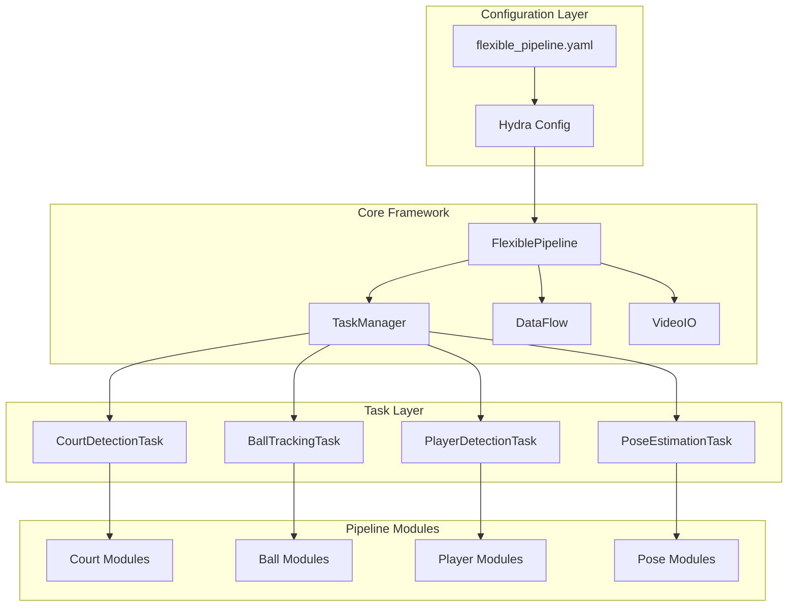
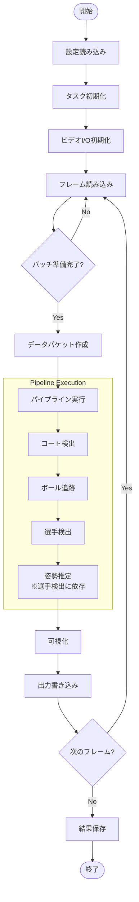
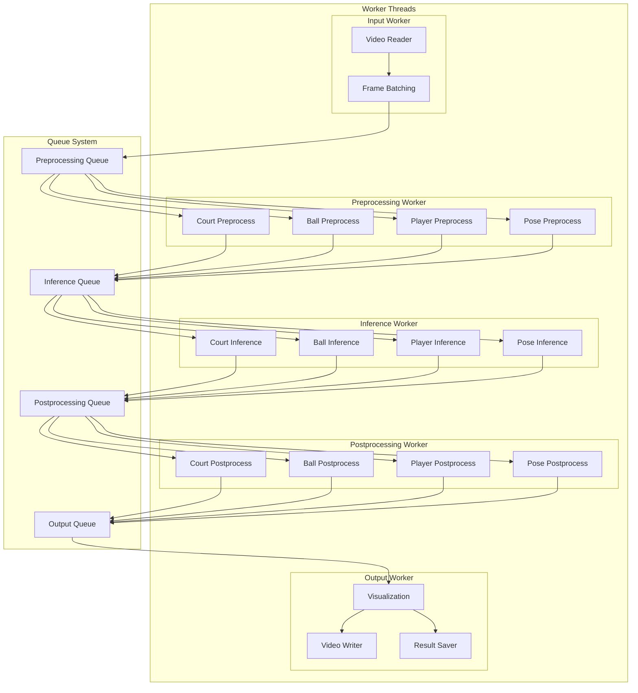
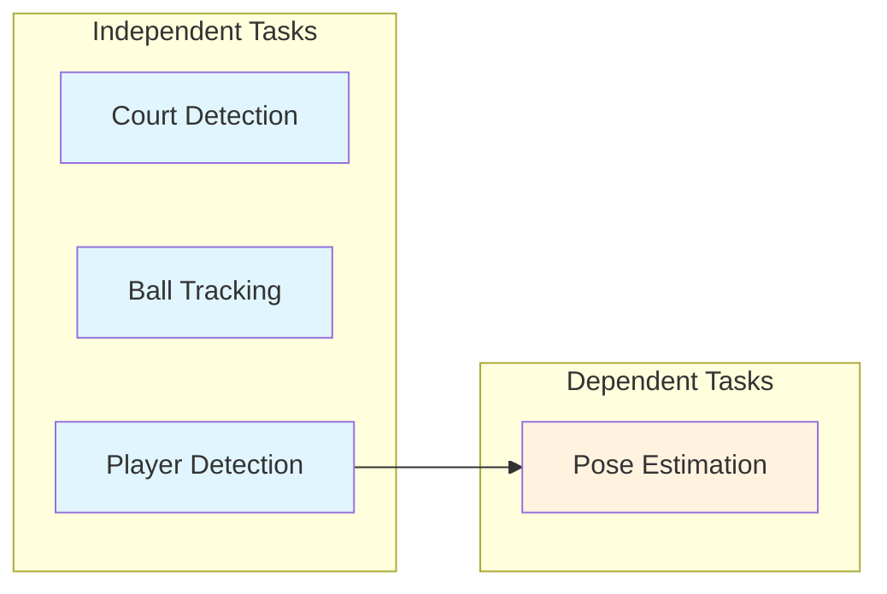
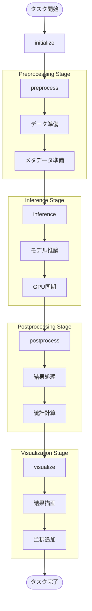
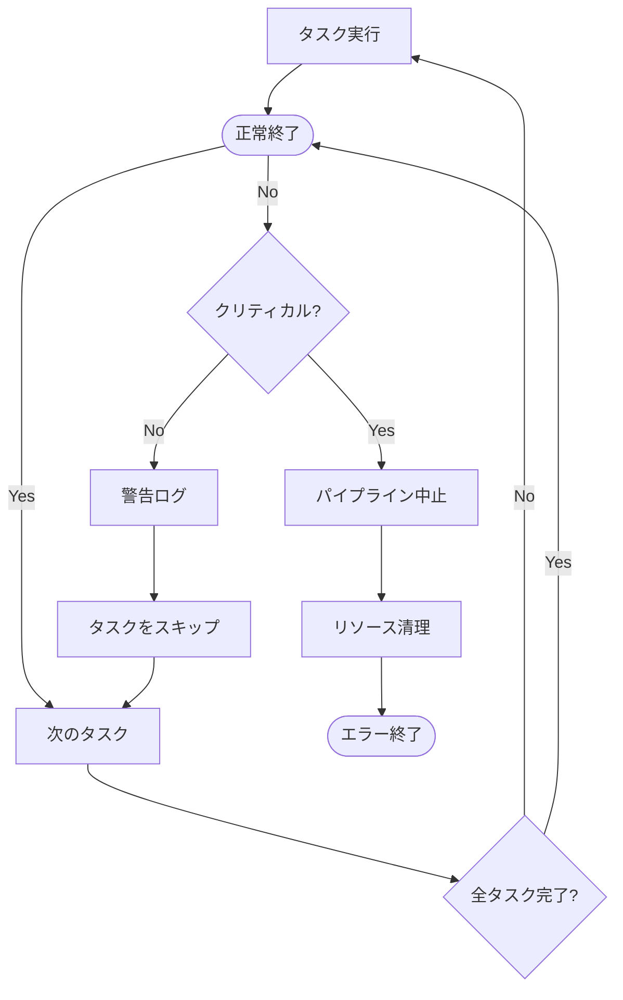
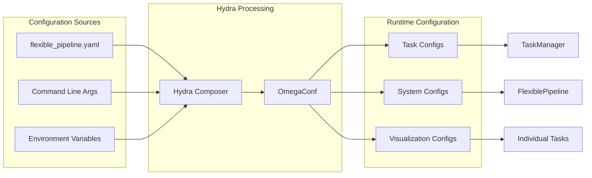
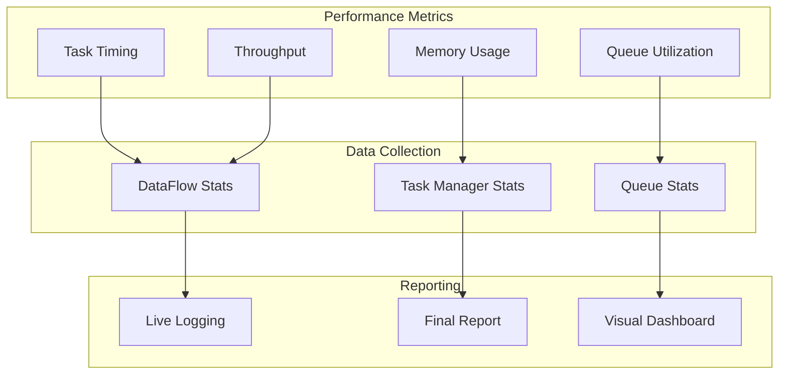

# Flexible Tennis Analysis Pipeline - Workflow Documentation

## システム全体のアーキテクチャ

## データフロー（シングルスレッドモード）

## データフロー（マルチスレッドモード）

## タスク依存関係グラフ

## タスク実行フロー（各タスク共通）

## エラー処理フロー

## 設定システム

## パフォーマンス監視

このワークフロー図により、システムの全体像と各コンポーネントの相互作用が明確に理解できます。