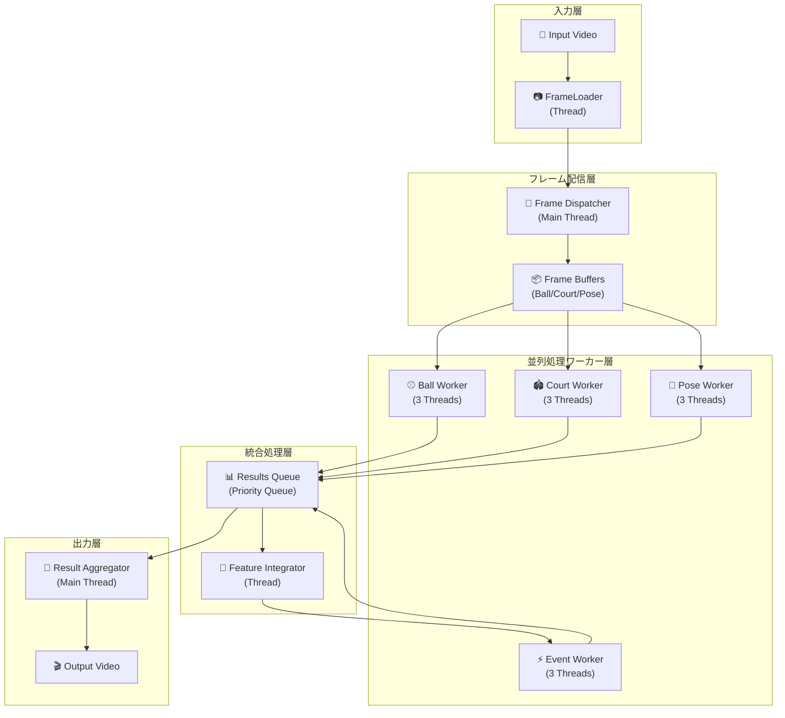
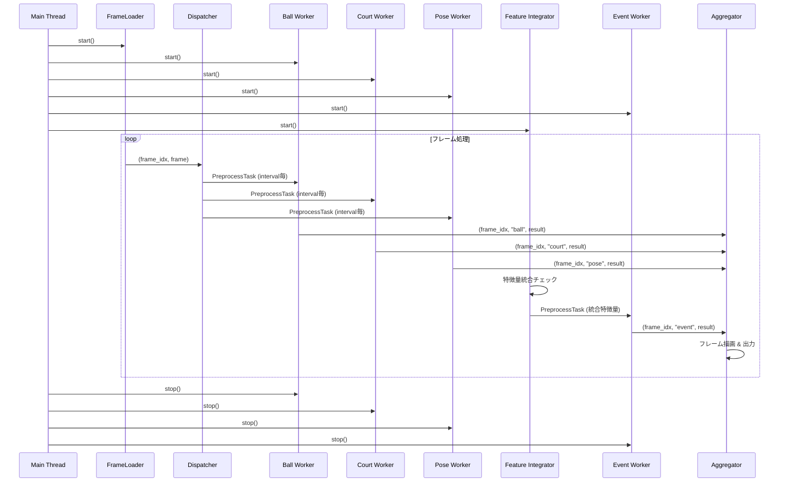
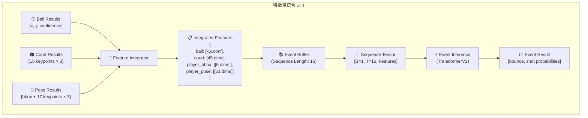
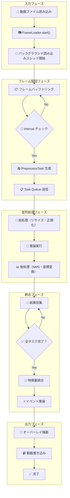

# Streaming Overlayer フロー詳細

## 概要

Streaming Overlayerは、テニス動画の複数モデル推論（Ball、Court、Pose、Event）を並列実行し、統合されたイベント検知を行うシステムです。本システムは3段階のパイプライン処理（前処理・推論・後処理）を多スレッドで実行し、リアルタイムでの動画解析を実現します。

## アーキテクチャ概要



## 詳細フロー

### 1. メイン処理フロー



### 2. ワーカー内部処理フロー

```mermaid
graph TD
    subgraph "各ワーカー内部（3並列スレッド）"
        PreQueue["🔄 Preprocess Queue"]
        InfQueue["🔄 Inference Queue"] 
        PostQueue["🔄 Postprocess Queue"]
        ResQueue["📊 Results Queue"]
        
        subgraph "Thread 1: 前処理"
            PreTask["📥 PreprocessTask"]
            PreProc["🔧 predictor.preprocess()"]
            InfTask["📤 InferenceTask"]
        end
        
        subgraph "Thread 2: 推論"
            InfProc["🧠 predictor.inference()"]
            PostTask["📤 PostprocessTask"]
        end
        
        subgraph "Thread 3: 後処理"
            PostProc["🔧 predictor.postprocess()"]
            Result["📊 Result"]
        end
    end
    
    PreQueue --> PreTask
    PreTask --> PreProc
    PreProc --> InfTask
    InfTask --> InfQueue
    
    InfQueue --> InfProc
    InfProc --> PostTask
    PostTask --> PostQueue
    
    PostQueue --> PostProc
    PostProc --> Result
    Result --> ResQueue
```



### 3. 特徴量統合プロセス



### 4. データフロー詳細



## 主要コンポーネント詳細

### MultiEventPredictor

メインクラスで、全体の処理フローを制御します。

**主要メソッド:**
- `run()`: メイン実行メソッド
- `_initialize_workers()`: ワーカー初期化
- `_dispatch_frames()`: フレーム配信制御
- `_start_feature_integration_thread()`: 特徴量統合スレッド開始
- `_aggregate_and_write_results()`: 結果集約・出力

### BaseWorker

全ワーカーの基底クラス。3段階パイプライン処理を実装。

**処理段階:**
1. **前処理スレッド**: フレーム前処理（リサイズ、正規化）
2. **推論スレッド**: モデル推論実行
3. **後処理スレッド**: 結果後処理（NMS、座標変換）

### 各専用ワーカー

#### BallWorker
- **目的**: ボール位置検知
- **出力**: `[x, y, confidence]`
- **特徴**: バウンディングボックス回帰

#### CourtWorker  
- **目的**: コートキーポイント検知
- **出力**: `[15 keypoints × 3]` (x, y, visibility)
- **特徴**: コートライン検知

#### PoseWorker
- **目的**: プレイヤー検知・ポーズ推定
- **出力**: `[bbox + 17 keypoints × 3]`
- **特徴**: 人物検知とポーズキーポイント

#### EventWorker
- **目的**: イベント検知（バウンス・ショット）
- **入力**: 統合特徴量シーケンス（16フレーム）
- **出力**: `[bounce_prob, shot_prob]`
- **特徴**: TransformerV2による時系列解析

### FrameLoader

動画読み込みを別スレッドで実行し、I/O待ちを解消。

**機能:**
- バックグラウンド読み込み
- フレームバッファリング（Queue）
- 動画プロパティ取得

## 処理タイミング制御

### Interval設定
各タスクの処理間隔を個別設定可能：
```python
intervals = {
    "ball": 1,    # 全フレーム
    "court": 30,  # 30フレーム毎  
    "pose": 3,    # 3フレーム毎
}
```

### Batch処理
効率化のためバッチ処理をサポート：
```python
batch_sizes = {
    "ball": 4,
    "court": 1,
    "pose": 2,
}
```

## パフォーマンス最適化

### 並列処理最適化
- **マルチスレッド**: 各ワーカー3スレッド（前処理・推論・後処理）
- **非同期処理**: Queue による非同期データ転送
- **バッファリング**: フレーム先読みでI/O待ち解消

### メモリ管理
- **Queue容量制限**: メモリ使用量制御
- **結果キャッシュ**: 描画用結果キャッシュ
- **適時解放**: 不要データの適時解放

### GPU利用最適化
- **推論専用スレッド**: GPU使用を推論スレッドに集約
- **バッチ処理**: GPU効率向上のためのバッチ化
- **メモリ最適化**: `torch.no_grad()` でメモリ使用量削減

## エラーハンドリング・デバッグ

### 例外処理
各処理段階で包括的な例外処理を実装：
- ログ出力による詳細エラー情報
- デバッグモードでのスタックトレース
- 処理継続のためのエラー回復

### デバッグ機能
```python
debug=True  # 詳細ログ・デバッグ情報の出力
```

### ログ管理
- 各ワーカーの処理状況監視
- パフォーマンス指標の記録
- エラー発生時の詳細情報記録

## 実行例

```python
from multi_event_predictor import MultiEventPredictor

predictor = MultiEventPredictor(
    ball_predictor=ball_model,
    court_predictor=court_model, 
    pose_predictor=pose_model,
    event_predictor=event_model,
    intervals={"ball": 1, "court": 30, "pose": 3},
    batch_sizes={"ball": 4, "court": 1, "pose": 2},
    event_sequence_length=16,
    debug=True
)

predictor.run("input_video.mp4", "output_video.mp4")
```

## 今後の拡張性

### スケーラビリティ
- 新しいモデルワーカーの追加容易性
- 処理パラメータの動的調整
- 分散処理への拡張可能性

### 機能拡張
- リアルタイムストリーミング対応
- 複数動画同時処理
- クラウド処理対応

この設計により、高度に並列化されたテニス動画解析システムが実現され、リアルタイム処理と高精度な統合解析を両立しています。 